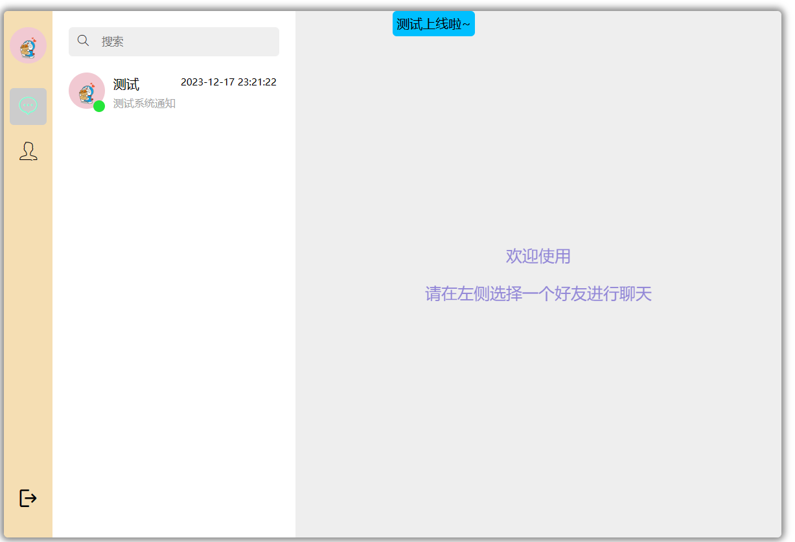
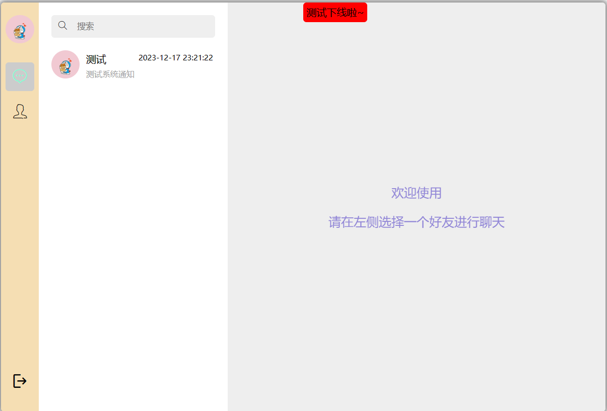
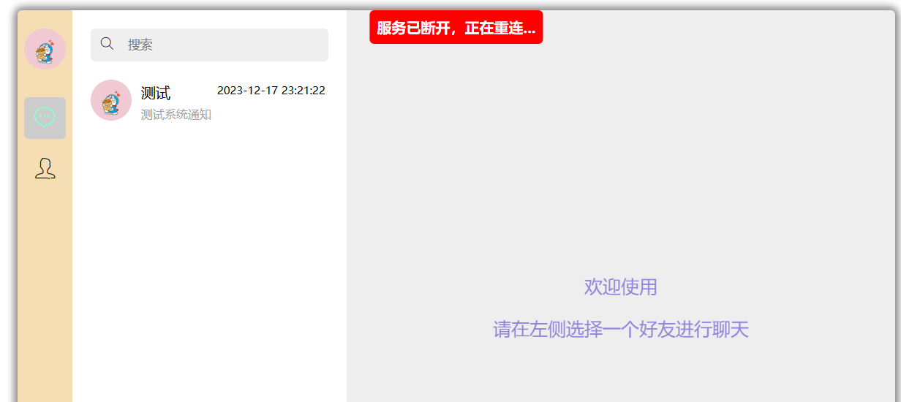
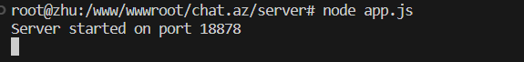

# nodejs构建的聊天室

## 登录
### 支持账号密码登录和扫码登录（新乡学院APP）

## 注册
### 仅支持新乡学院APP扫码注册

## 忘记密码
### 仅支持新乡学院APP扫码修改密码

## 聊天
### 界面
页面高仿QQNT版本，支持文字，图片，表情（1000+表情任你挑选），也支持图文一块发送，粘贴图片至输入框发送。选择本地图片发送。
### 功能
目前仅有聊天功能，和查看聊天室全部人员功能，后续会加入更多功能，敬请期待。
### 特性
#### 1.支持好友上线提醒。
#### 2.服务器离线提醒。
#### 3.ws断线重连。
#### 4.前后端心跳包，进行ws长连接保活。
#### 5.消息前端实时更新，ws消息直接推送至目标用户，无需轮询。
#### 6.头像处显示用户在线状态。
#### 7.消息已读自动处理
#### 8.系统级消息通知
#### 9.首次登录引导页面




# 运行方式
## 前端
前端为静态文件nginx直接部署即可
## 后端
```bash
cd server
npm i
node app.js
```
即可运行后端服务

当你看到```Server started on port 18878```时，说明后端服务已经启动成功

记得在nginx中屏蔽/server目录,或者将server目录放在其他地方
配置nginx反向代理